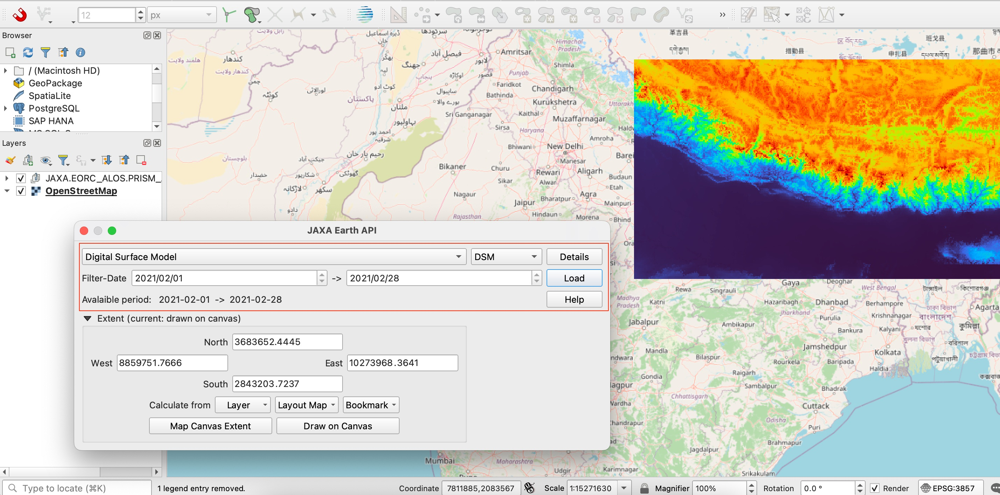

# JAXA Earth API Plugin

QGIS Plugin for JAXA Earth API

## Usage

1. Install the plugin via QGIS Plugin repository or ZIP-file downloadble from releases.
2. Dockwidget added in your QGIS
    -   
3. Set CRS to EPSG:4326 or EPSG:3857 and move map to area of your interest
    - -   
4. Select Dataset, select a band, then Load!
    1. you can select date-range (Earth API seems to be currently available in 2021 only)
    -   

** Note **
This plugin is not related [JAXA](https://www.jaxa.jp/). It is just using [JAXA Earth API for Python](https://data.earth.jaxa.jp/api/python/index.html) distributed by JAXA. JAXA Earth API for Python is Prototype so that this plugin is also Prototype.